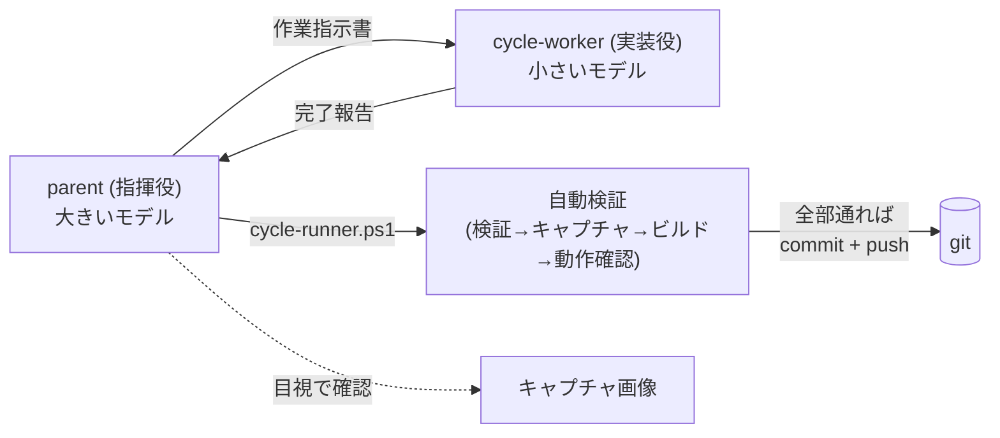

# codex-cycle-kit

[Codex CLI](https://github.com/openai/codex) で、AI に **「1 ファイル + 明示した関連ファイルだけ」編集させ → 自動で検証 → commit → push** まで進める運用パターンのテンプレ集です。

実プロジェクト(Unity 製 HD-2D ゲーム)に投入した結果、1 サイクルあたりの平均トークン消費が **約 84% 減** (36.7M → 6.0M、348 サイクル平均) になりました。連続稼働では、私が途中でレビュー用のプロンプトを差し込むまでに **22.5 時間** 動き続けたランがあります。抽象度の高いゴールならさらに長く回せます。

なお Era1 (元の体制) は `worker` まで大きいモデル (gpt-5.5) で動かしていたので出発点が高めです。最初から軽量モデルでサブエージェントを回している環境では削減幅は小さくなります。

詳しい設計と運用記録は Zenn 記事 ([トークン84%減 + 長時間連続自走を実現したAIワーカーのCycle運用 (Codex CLI)](https://zenn.dev/marvelousu/articles/codex-cli-cycle-ops)) を参照してください。

## このパターンの考え方



- **指揮役** (`parent`) が大きいモデル (例: `gpt-5.5`) を使い、「今回のゴールはこれ、編集するファイルはこの 1 つ」とだけ決めます
- **実装役** (`cycle-worker`) が小さいモデル (例: `gpt-5.4-mini`) を使い、指示された 1 ファイル + 関連ファイルだけ編集します
- **自動化スクリプト** (`cycle-runner`) が、編集後の検証 → 画面キャプチャ → ビルド → 動作確認 → commit + push を順番に実行します
- 最後に `parent` が目視でキャプチャ画像を確認し、見た目に問題がなければサイクル完了です

実装は小さいモデル、判断は大きいモデルに分けるだけです。これだけで 1 サイクルのトークン消費が大きく下がります。

## 1 サイクルの中で起きていること

1. `parent` が「今回のゴール」と「編集する 1 ファイル」を決めます
2. `parent` が `cycle-start` skill を呼んで、`cycle-worker` に渡す**作業指示書**を作ります
   - 編集してよいファイル(対象 1 つ + 関連 N 個)を明示します
   - やってほしいことを 2〜6 行で短く具体的に書きます
   - プロジェクトのルール(後述の「規律ゲート」)も一緒に貼ります
3. `parent` が `cycle-worker` を起動し、作業指示書を渡します
4. `cycle-worker` が指示どおり編集し、最後に「検証メソッド名」「キャプチャメソッド名」を返します
5. `parent` が `cycle-runner.ps1` を起動します。スクリプトが次の 4 ステップを順に実行します:
   1. **検証**: テスト用メソッドを呼んで状態をチェック
   2. **キャプチャ**: スクリーンショットやログを生成
   3. **ビルド**: 実行可能ファイルを作成 (不要なら `-SkipBuild` でスキップ)
   4. **動作確認**: ビルド成果物を短時間動かしてログをチェック
6. 全部通れば自動で commit + push まで進みます (`-SkipPush` で push を抑制し、commit だけで止めることもできます。詳細は後述の「自動 commit + push について」)
7. `parent` がキャプチャ画像を目視で確認し、見た目に問題があれば次サイクルで対応します

**1 サイクル = 1 コミット**、**`cycle-worker` 1 回起動 = 1 ファイル (+ 関連) 編集** で固定するのがポイントです。

## 構成

3 つの独立したコンポーネントから成ります。全部一緒に使うことも、必要な部分だけ取り出すこともできます。

```
codex-cycle-kit/
├── agents/
│   └── cycle-worker.toml       → ~/.codex/agents/    (worker agent 定義)
├── skills/
│   └── cycle-start/            → ~/.codex/skills/    (作業指示書テンプレ)
│       ├── SKILL.md
│       └── references/
│           ├── scoped-prompt-template.md
│           └── reference-implementation-unity.md
└── scripts/
    └── cycle-runner.ps1        → <your-repo>/tools/  (4 ステップ自動化)
```

## インストール

### 全部入れる場合

#### PowerShell (Windows)

```powershell
git clone https://github.com/marvelousu/codex-cycle-kit.git
cd codex-cycle-kit
Copy-Item -Recurse agents/* $HOME/.codex/agents/
Copy-Item -Recurse skills/* $HOME/.codex/skills/
Copy-Item scripts/cycle-runner.ps1 <your-project>/tools/
```

#### Bash (Linux / macOS)

```bash
git clone https://github.com/marvelousu/codex-cycle-kit.git
cd codex-cycle-kit
mkdir -p ~/.codex/agents ~/.codex/skills
cp -r agents/* ~/.codex/agents/
cp -r skills/* ~/.codex/skills/
cp scripts/cycle-runner.ps1 <your-project>/tools/
```

インストール後、Codex CLI を再起動してください。`/skill` 一覧に `cycle-start` が出れば成功です。`cycle-runner.ps1` は Windows の PowerShell 5.1 以上、または Linux / macOS の `pwsh` 7 以上で動きます。

### 必要な部分だけ取り出す

| 用途 | 入れるもの | できること |
|---|---|---|
| 全部入り | 3 ディレクトリ全部 | `parent` → `cycle-worker` → 自動化の一連のサイクル |
| **作業指示書テンプレだけ** | `skills/cycle-start/` を `~/.codex/skills/` へ | 作業指示書の作り方だけ流用。`cycle-worker` は好きなモデルで |
| **`cycle-worker` だけ** | `agents/cycle-worker.toml` を `~/.codex/agents/` へ | `parent` から起動する `cycle-worker`。作業指示書は手で書く |
| **`cycle-runner` だけ** | `scripts/cycle-runner.ps1` をリポの `tools/` へ | 検証 → ビルド → commit/push の一括実行。`cycle-worker` なしでも使える |

## 使い方

新しい Codex セッションの先頭、もしくはプロジェクトの `AGENTS.md` に下記を貼ります。

```
For each cycle, follow this protocol:
1. Decide cycle goal and the single authored file the worker will edit.
2. Use skill `cycle-start` to draft the scoped prompt; fill all placeholders.
3. Spawn sub-agent `cycle-worker` via multi_agent with that scoped prompt.
4. Extract validate_method and capture_method from WORKER_RESULT.
5. Draft this cycle's devlog .md (H1 line becomes the commit subject).
6. Run tools/cycle-runner.ps1 with the extracted method names and the devlog path.
7. Review the captured artifacts (visual / quality gate). Revert and re-cycle if not passing.

Details: ~/.codex/skills/cycle-start/SKILL.md and ~/.codex/agents/cycle-worker.toml.
```

各サイクルの起動はこれ 1 行で済みます。

```
cycle <N> を回して。目標は <一行ゴール>、編集するファイルは <path>。
```

## 自動 commit + push について

このキットは、各サイクルの完了時に **commit + push まで自動で進める** のをデフォルトにしています。これは、AI が長時間連続で自走するときに「各サイクルが巻き戻せる検証点として残る」「監視できない時間帯に止まっても、状態が remote に同期されている」「後で 1 サイクル単位で運用記録を遡れる」という想定での運用パターンに合わせたものです。

チーム開発で PR レビューを前提とする場合や、共有ブランチに細かい commit を push したくない場合は、`-SkipPush` で push を抑制してください。commit までは走るので、各サイクルの巻き戻し点は手元に残ります。

```powershell
pwsh -File tools/cycle-runner.ps1 ... -SkipPush
```

ローカルでも commit を作りたくない場合は、`cycle-runner` を使わずに validate / capture フェーズだけ手で呼ぶ運用も可能です(`cycle-runner` 単独の利用は前述のサブセット install を参照)。

## Unity 以外のプロジェクトで使う

cycle-runner は Unity Editor の呼び出しを既定にしていますが、起動コマンドは差し替えられます。たとえば Node.js のコード生成スクリプトを使うなら:

```powershell
pwsh -File tools/cycle-runner.ps1 `
    -CycleNumber 7 `
    -ValidateMethod scripts/validate.js `
    -CaptureMethod  scripts/capture.js `
    -DevlogPath     docs/devlog/cycle07.md `
    -BatchTool      node `
    -BatchArgsTemplate '{method} --project "{projectPath}" --log "{logFile}"' `
    -SkipBuild
```

### 差し替えられる項目

| 引数 | 意味 |
|---|---|
| `-BatchTool` | 検証 / キャプチャ / ビルドで起動するコマンド (既定: `Unity.exe`)。環境変数 `CYCLE_BATCH_TOOL` でも上書き可 |
| `-BatchArgsTemplate` | コマンドに渡す引数テンプレ。`{projectPath}` / `{method}` / `{logFile}` を置換 |
| `-SmokeArgsTemplate` | 動作確認の引数テンプレ。動作確認はビルド成果物を直接実行する |
| `-BuildArtifactPattern` | ビルドログから成果物パスを抜き出す正規表現 |
| `-SmokePatterns` | 動作確認ログで失敗と見なすパターン (パイプ区切り正規表現) |
| `-SkipBuild` | ビルド + 動作確認をまとめてスキップ |
| `-SkipPush` | 各サイクル完了時の自動 `git push` を抑制 (commit までは走る) |
| `-CommitPath` | commit 前に stage するパス (既定は `git add -A`) |
| `-NoRollback` | 失敗時に `git reset --hard` を実行せず、worktree を残して手で確認できる |

全パラメータは `Get-Help tools/cycle-runner.ps1 -Full` で確認できます。

## プロジェクト固有のルール (規律ゲート)

作業指示書には `## Project gates` という節があります。プロジェクト固有の「譲れないルール」を一度書いておけば、毎サイクル自動で `cycle-worker` に渡されます。よくあるルールの例:

- **見た目の最終確認は人間がやる**: 検証メソッドが通っても、見た目チェックは人間がキャプチャ画像で行う
- **対話ツールで行った編集はコードに反映する**: 後で再現できなくなるため
- **省略したステップは隠さず申告する**: 上流ステップを飛ばしたら正直に表面化する

Unity プロジェクトでの具体例は [`skills/cycle-start/references/reference-implementation-unity.md`](skills/cycle-start/references/reference-implementation-unity.md) を参照してください。

## 必要なもの

- **Codex CLI** 0.130.0 以上
- **PowerShell** 5.1 以上 (Windows) または **pwsh** 7 以上 (Linux / macOS): `cycle-runner` の実行に使います
- **バッチで起動できる検証ツール**: Unity Editor の `Unity.exe -executeMethod`、Node.js の `node script.js`、Python の `python -m`、組み込み toolchain CLI など。runner はツール非依存です

## 由来

このキットは、稼働中の Unity (HD-2D) ゲームプロジェクトの運用から抽出したものです。このパターンに切り替えてから、1 サイクルあたりの平均トークン消費が **約 84% 減** (36.7M → 6.0M、348 サイクル平均) になりました。連続稼働の最長は、私がレビュー用のプロンプトを差し込んだ時点で区切れた **22.5 時間** 連続のランです。「自由会話の QA」を「決まったバッチ検証」に置き換え、実装作業を小型モデルの `cycle-worker` に押し出した結果です。

ただし数値はプロジェクトによって変わります。Era1 (元の体制) は `worker` まで大きいモデル (gpt-5.5) で動かしていたため出発点が高めで、最初から軽量モデルでサブエージェントを回している環境では削減幅は小さくなります。クロスファイルの context 読み込みが多いプロジェクトほど効果は大きく出る傾向があります。

## ライセンス

[MIT License](LICENSE)
